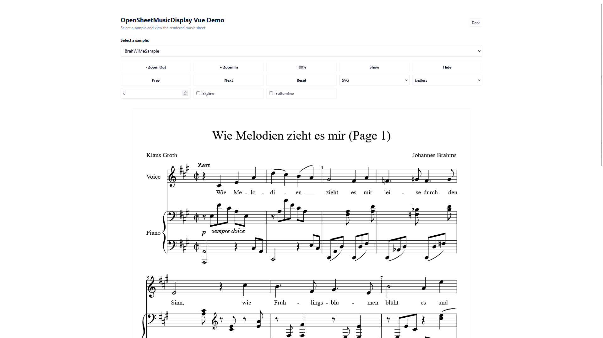

# OSMD Vue Demo

一个基于 Vue 3 + TypeScript 的音乐乐谱渲染演示项目，使用 OpenSheetMusicDisplay 库展示 MusicXML 格式的乐谱。



## About

A music sheet display demo built with Vue 3, TypeScript, and Vite. It showcases how to integrate OpenSheetMusicDisplay (OSMD) with Vue 3 to render musical scores in MusicXML format with modern web technologies.

## Features

- **Sheet Music Rendering** - Display MusicXML files with OSMD
- **Vue 3 Composition API** - Modern Vue development with `<script setup>`
- **TypeScript Support** - Full type safety and IDE support
- **Tailwind CSS** - Utility-first styling
- **Vite** - Lightning-fast build tool and dev server

## Quick Start

```bash
# Install dependencies
npm install

# Development server
npm run dev
```
